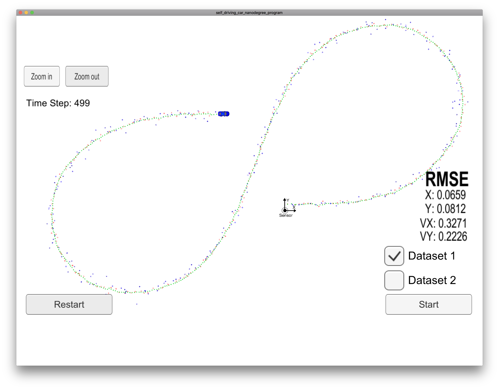
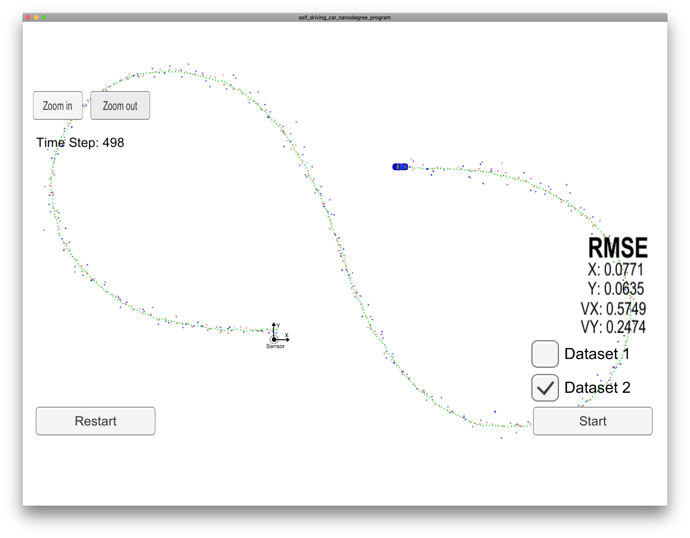

# Unscented Kalman Filter Project - Gaspard Shen
 In this project, I implement an unscented Kalman filter using the CTRV motion model. By using the same bicycle simulation data set from the previous extended Kalman filter project, I can get px, py, vx and vy RMSE valuse **[.065, .081, .32, .22]** for Dataset 1 and **[.077, .063, .57, .24]** for Dataset 2 which pass the criteria in the project rubric.

## Implementation
Most of the Implementation was based on the instruction of the lecture coding exercise.
Couple thing need try by ourself are:
1. Need to initialize the **state vector x** and **state covariance matrix P** with appropriate values.
2. **Normalize angles** so that angles are between −π and π.
3. Check for **Divide By Zero**
4. Tune the process noise parameters **std_a_** and **std_yawdd_**

Here list some record of the parameter tuning.
In the end, I choose `std_a_` as **1.0** and `std_yawdd_` as **0.5** and the covariance matrix P_ as
```
0.15, 0, 0, 0, 0
0, 0.15, 0, 0, 0
0,    0, 1, 0, 0
0,    0, 0, 1, 0
0,    0, 0, 0, 1
```

Tuning the P_ and init V of state vector x_
```
std_a_ = 3.0; std_yawdd_ = 1.0;

init V: 5.0
Dataset1: X: 0.0735, Y: 0.0852, VX: 0.2027, VY: 0.2830
Dataset2: X: 0.0749, Y: 0.0849, VX: 0.7623, VY: 0.4601

init V: 3.0
Dataset1: X: 0.0740, Y: 0.0861, VX: 0.3485, VY: 0.3691
Dataset2: X: 0.0729, Y: 0.0757, VX: 0.6353, VY: 0.2944

init V: 0.0
Dataset1: X: 0.0731, Y: 0.0846, VX: 0.3521, VY: 0.2555
Dataset2: X: 0.0804, Y: 0.0734, VX: 0.5920, VY: 0.2961

std_a_ = 1.0; std_yawdd_ = 0.5;
Dataset1: X: 0.0659, Y: 0.0812, VX: 0.3271, VY: 0.2226
Dataset2: X: 0.0771, Y: 0.0635, VX: 0.5749, VY: 0.2474
```
## Results
Below are the result of Dataset 1 and set 2, set 1 can pass the project criteria [.09, .10, .40, .30].
As compare with the previous extended Kalman filter result for set 1 [.097, .085, .45, .43] and set 2 [.072, .096, .45, .49]. UKF result are much better.

Dataset 1 RMSE: [.065, .081, 0.32, .22]


Set 2 vx was a little over the criteria but py has better result even than set 1.
Dataset 2 RMSE: [.077, .063, .57, .24]

